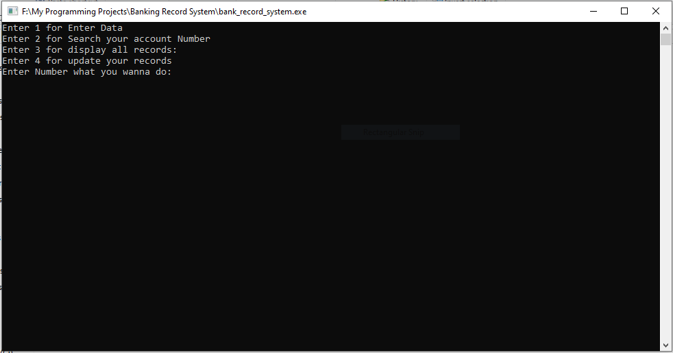

# simple-bank-record-system-CLI-

This program lets you maintain simple bank records in txt file

Features:
1) Enter Data and write into txt file
2) search data whether if it exists in txt file
3) display all records in txt file
4) Edit Record
5) Exception Handling
6)Delete Record:
